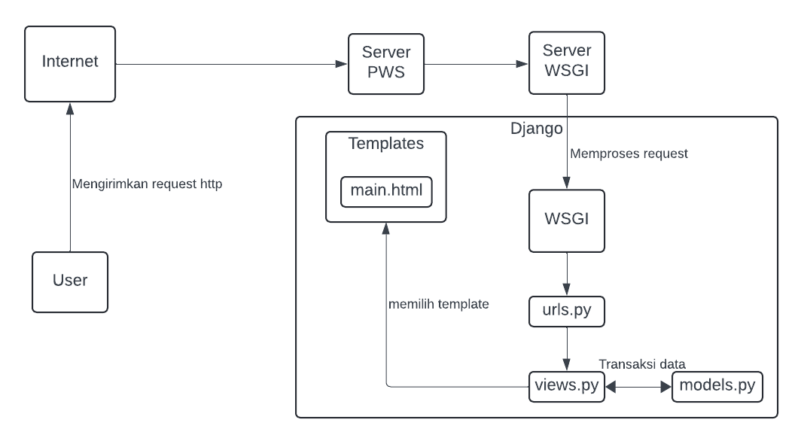
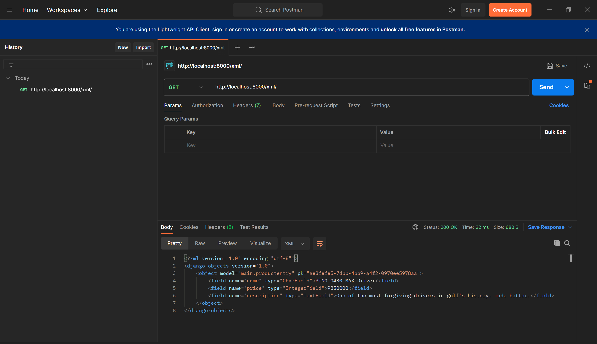
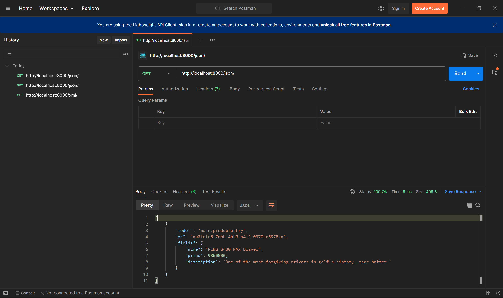
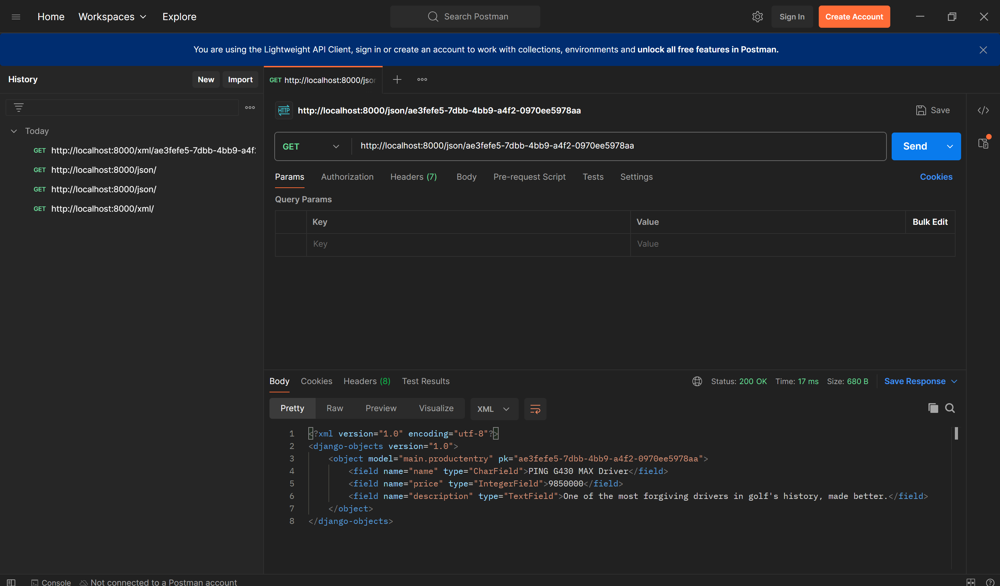

# Pro Shop

Repositori ini berisi aplikasi web berbasis Django untuk mengelola dan menampilkan katalog produk golf. Aplikasi ini dikembangkan sebagai bagian dari tugas mata kuliah PBP.

http://fadhli-raihan-proshop.pbp.cs.ui.ac.id/

<details>
    <summary>Tugas 2: Implementasi Model-View-Template (MVT) pada Django</summary>

## Step by step proyek

### A. Membuat repositori baru dan inisialisasi git
1. Buat repositori baru bernama `pro-shop`
2. Pilih sebuah direktori lokal dan inisialisasi git:
    ```bash
    git init
    git remote add origin <URL>
    ```

### B. Membuat virtual environment
1. Aktifkan virtual environment:
    - **Windows**:
        ```bash
        env\Scripts\activate
        ```
    - **Linux/macOS**:
        ```bash
        source env/bin/activate
        ```
### C. Menginstall package
1. Buat file `requirements.txt` dengan isi daftar package yang diperulkan.
2. Jalankan perintah untuk menginstall package yang diperlukan:
     ```bash
    pip install -r requirements.txt
    ```

### D. Membuat proyek Django
1. Buat proyek Django baru dengan nama `pro_shop`
    ```bash
    django-admin startproject kanade_record_store
    ```
2. Buat aplikasi baru bernama `main`
    ```bash
    django-admin startapp main
    ```
3. Tambahkan `localhost` dan `127.0.0.1` ke dalam list `ALLOWED_HOSTS` pada `settings.py`
4. Tambahkan aplikasi `main` ke dalam list  `INSTALLED_APPS` pada `settings.py`
5. Tambahkan kode berikut pada file `views.py` untuk mengintegrasikan komponen MVT:
    ```python
    from django.shortcuts import render

    def show_main(request):
        context = {
            'app_name' : 'Pro Shop',
            'name': 'Fadhli Raihan Ardiansyah',
            'class': 'PBP D',
        }
        return render(request, "main.html", context)
    ```
6. Buat direktori baru bernama `templates` di dalam direktori `main`
7. Di dalam `templates` buat file `main.html`:
    ```html
    <p>{{ app_name }}</p>
    <h5>Nama: </h5>
    <p>{{ name }}</p> 
    <h5>Class: </h5>
    <p>{{ class }}</p> 
    ```
8. Buat file `urls.py` baru di direktori main kemudian isi dengan kode berikut:
    ```python
    from django.urls import path
    from main.views import show_main

    app_name = 'main'

    urlpatterns = [
        path('', show_main, name='show_main'),
    ]

9. Buka file `urls.py` **yang berada di dalam direktori proyek** dan tambahkan kode berikut:
    ```python
    ...
    from django.urls import path, include
    ...
    urlpatterns = [
        ...
        path('', include('main.urls')),
        ...
    ]
    ```
10. Di `models.py` tambahkan atribut berikut:
    ``* name = models.CharField(max_length=255)
    ``* price = models.IntegerField
    ``* description = models.TextField

11. Jalan kode berikut untuk membuat migrasi model dan menjalankannya:
    ```python
    python manage.py makemigrations
    python manage.py migrate
    ```

12. Buat proyek baru di Pacil Web Service dengan nama `proshop`
13. Pada file `settings.py` tambahkan `fadhli-raihan-proshop.pbp.cs.ui.ac.id`
14. Lakukan `git add`, `commit`, dan `push` ke repositori
15. Tambahkan remote pws ke repositroi:
    ```bash
    git remote add pws http://pbp.cs.ui.ac.id/fadhli.raihan/proshop
    git branch -M master
    git push pws master
    ```

16. Sekarang aplikasi dapat diakses dengan url `fadhli-raihan-proshop.pbp.cs.ui.ac.id`

## Bagan request client ke web aplikasi berbasis Django


1. Saat user mengirimkan request http ke server PWS, request tersebut akan diteruskan ke server WSGI
2. Server WSGI mengarahkan request ke aplikasi Django
3. `urls.py` mencocokkan URL dan meneruskan ke view yang sesuai
4. `views.py` memproses request dan mengambil data yang dibutuhkan dari `models.py`
5. `views.py` mengembalikan respons berupa template HTML yang kemudian dikirimkan ke user

## Fungsi Git dalam pengembangan perangkat lunak
Git berfungsi sebagai sistem kontrol yang memungkinkan developer untuk melacak perubahan kode, bekerja secara kolaboratif, mengelola berbagai versi proyek, dan mendukung penggabungan kode dari beberapa developer secara aman dan terstruktur. Git juga membantu dalam melihat riwayat perubahan, memudahkan pengembalian ke versi sebelumnya, dan memungkinkan pengembangan paralel melalui fitur branching.

## Mengapa framework Django dijadikan permulaan pembelajaran pengembangan perangkat lunak
1. Django menggunakan bahasa pemrograman Python yang relatif mudah
2. Django menyediakan arsitektur Model-View-Template (MVT) yang membantu pemula memahami konsep dasar pengembangan web dengan jelas.
3. Django menawarkan banyak fitur bawaan seperti sistem autentikasi, ORM, dan sistem administrasi yang memudahkan developer.

## Mengapa model pada Django disebut sebagai ORM?
Model pada Django disebut ORM (Object-Relational Mapping) karena Django menyediakan sistem yang secara otomatis memetakan objek-objek python (model) ke tabel-tabel di database. Dengan ORM developer dapat berinteraksi dengan data langsung menggunakan bahasa pemrograman Python tanpa menggunakan SQL.
</details>

<details>
    <summary>Tugas 3: Implementasi Form dan Data Delivery pada Django</summary>

## Mengapa kita memerlukan data delivery pada pengimplementasian sebuah platform?
Data delivery diperlukan untuk memastikan sistem terhubung dengan baik, sehingga kita bisa mengelola data dengan efisien dan memberikan pengalaman pengguna yang cepat dan responsif.

## Menurutmu, mana yang lebih baik antara XML dan JSON? Mengapa JSON lebih populer dibandingkan XML?
XML: Format data berbasis tag yang digunakan untuk menyimpan dan mentransfer data.

JSON: Format data berbasis pasangan key-value yang digunakan untuk menyimpan dan mentransfer data yang mudah dibaca manusia.

JSON relatif lebih populer dalam pengembangan web karena beberapa hal berikut:

1. JSON memiliki sintaks yang lebih sederhana dan mudah dibaca.
2. JSON umumnya menghasilkan data yang lebih kecil karena tidak memerlukan tag pembuka dan penutup.
3. JSON lebih mudah dan lebih cepat diparse.

## Jelaskan fungsi dari method is_valid() pada form Django dan mengapa kita membutuhkan method tersebut?
Method `is_valid()` berfungsi untuk memeriksa apakah data yang dikirim melalui form memenuhi semua aturan validasi yang ditentukan. Kita membutuhkan method tersebut untuk memastikan kebenaran input.

## Mengapa kita membutuhkan csrf_token saat membuat form di Django? Apa yang dapat terjadi jika kita tidak menambahkan csrf_token pada form Django? Bagaimana hal tersebut dapat dimanfaatkan oleh penyerang?

CSRF (Cross-Site Request Forgery) adalah jenis serangan dimana penyerang memanfaatkan kredensial pengguna untuk melakukan tindakan tidak sah. Dalam konteks Django, `csrf_token` membantu melindungi aplikasi web dari serangan CSRF dengan memastikan setiap permintaan yang memodifikasi data (seperti request POST) berasal dari pengguna yang sah.

Tanpa `csrf_token`, penyerang dapat membuat pengguna yang sah mengirimkan permintaan yang tidak diinginkan seperti mengubah data menggunakan kredensial pengguna yang sudah ada.

## Step-by-step implementasi checklist
### Membuat input form untuk menambahkan objek model
#### Implementasi Skeleton sebagai kerangka Views
1. Membuat direktori `templates` pada direktori utama.
2. Buat berkas HTML baru bernama `base.html` berisi kode berikut:
```html

<!DOCTYPE html>
<html lang="en">
  <head>
    <meta charset="UTF-8" />
    <meta name="viewport" content="width=device-width, initial-scale=1.0" />
     
  </head>

  <body>
     
  </body>
</html>
```
3. Buka `settings.py` pada direktori proyek kemudian menambahkan kode berikut ke dalam variabel `TEMPLATES`:
```python
...
TEMPLATES = [
    {
        'BACKEND': 'django.template.backends.django.DjangoTemplates',
        'DIRS': [BASE_DIR / 'templates'],
        'APP_DIRS': True,
        ...
    }
]
...
```

#### Menambahkan UUID untuk objek model
1. Buka `models.py` di subdirektori `main/` kemudian ubah menjadi berikut:
```python
import uuid
from django.db import models

class ProductEntry(models.Model):
    id = models.UUIDField(primary_key=True, default=uuid.uuid4, editable=False) 
    name = models.CharField(max_length=255)
    price = models.IntegerField(default=0)
    description = models.TextField(default="")
```

2. Lakukan migrasi dengan perintah berikut:
```bash
python manage.py makemigrations
python manage.py migrate
```
#### Membuat form input
1. Buat file baru dengan nama `forms.py` kemudian tambahkan kode berikut ke dalamnya:
```python
from django.forms import ModelForm
from main.models import ProductEntry

class ProductForm(ModelForm):
    class Meta:
        model = ProductEntry
        fields = ["name", "price", "description"]
```

2. Pada file `views.py` di direktori `main` tambahkan beberapa import berikut:
```python
from django.shortcuts import render, redirect
from main.forms import ProductForm
from main.models import ProductEntry
```
3. Di file yang sama buat fungsi dengan nama `create_product_entry` yang menerima parameter request.
```python
def create_product_entry(request):
    form = ProductForm(request.POST or None)

    if form.is_valid() and request.method == "POST":
        form.save()
        return redirect('main:show_main')

    context = {'form': form}
    return render(request, "create_product_entry.html", context)
```
4. Pada file `urls.py` di direktori `main` import fungsi tadi kemudan tambahkan path url untuk mengakses fungsinya.
```python
...
from main.views import show_main, create_mood_entry
...
urlpatterns = [
    ...
    path('create-product-entry', create_product_entry, name='create_product_entry'),
]
```
5. Buat file HTML baru dengan nama `create_product_entry.html` pada direktori `main/templates`. File ini akan digunakan sebagai template untuk tampilan menambahkan produk baru.
```html
 

<h1>Add New Mood Entry</h1>

<form method="POST">
  
  <table>
    {{ form.as_table }}
    <tr>
      <td></td>
      <td>
        <input type="submit" value="Add Product" />
      </td>
    </tr>
  </table>
</form>


```
6. Mengubah file `main.html` agar menampilkan produk dalam bentuk tabel dan menambahkan tombol `Add Product` yang mengarahkan ke halaman form.
```html


<h1>Welcome to Pro Shop</h1>

<h5>Name:</h5>
<p>{{ name }}</p>

<h5>Class:</h5>
<p>{{ class }}</p>


<p>Currently, there are no products available in Pro Shop.</p>

<table>
  <thead>
    <tr>
      <th>Name</th>
      <th>Price</th>
      <th>Description</th>
    </tr>
  </thead>
  <tbody>
    
    <tr>
      <td>{{ product.name }}</td>
      <td>{{ product.price }}</td>
      <td>{{ product.description }}</td>
    </tr>
    
  </tbody>
</table>


<br />

<a href="">
  <button>Add New Product</button>
</a>


```

### Menambahkan 4 fungsi views untuk melihat objek yang sudah ditambahkan dalam format XML, JSON, XML by ID, dan JSON by ID.

1. Buka file `views.py` di direktori `main` kemudian tambahkan import berikut:
```python
from django.http import HttpResponse
from django.core import serializers
```

2. Buat 4 fungsi baru untuk melihat objek dalam format XML, JSON, XML by ID, dan JSON by ID.

\
Mengembalikan data dengan format XML
```python
def show_xml(request):
    data = ProductEntry.objects.all()
    return HttpResponse(serializers.serialize("xml", data), content_type="application/xml")
```
Mengembalikan data dengan format JSON
```python
def show_json(request):
    data = ProductEntry.objects.all()
    return HttpResponse(serializers.serialize("json", data), content_type="application/json")
```
Mengembalikan data dengan format XML berdasarkan ID
```python
def show_xml_by_id(request, id):
    data = ProductEntry.objects.filter(pk=id)
    return HttpResponse(serializers.serialize("xml", data), content_type="application/xml")
```
Mengembalikan data dengan format JSON berdasarkan ID
```python
def show_json_by_id(request, id):
    data = ProductEntry.objects.filter(pk=id)
    return HttpResponse(serializers.serialize("json", data), content_type="application/json")
```

### Membuat routing URL untuk masing-masing views yang sudah ditambahkan

1. Ubah file `urls.py` di direktori `main` menjadi seperti berikut:
```python
from django.urls import path
from main.views import show_main, create_product_entry, show_xml, show_json, show_xml_by_id, show_json_by_id


app_name = 'main'

urlpatterns = [
    path('', show_main, name='show_main'),
    path('create-product-entry', create_product_entry, name='create_product_entry'),
    path('xml/', show_xml, name='show_xml'),
    path('json/', show_json, name='show_json'),
    path('xml/<str:id>/', show_xml_by_id, name='show_xml_by_id'),
    path('json/<str:id>/', show_json_by_id, name='show_json_by_id'),
]
```
### Push ke github dan PWS

1. Jalankan perintah berikut:
```bash
git add .
git commit -m "Tugas 3"
git push origin master
git push pws master
```

### Screenshot hasil akses URL pada Postman
1. XML


2. JSON


3. XML by ID


4. JSON by ID


</details>

<details>
<summary>Tugas 4: Implementasi Autentikas, Session, dan Cookies pada Django</summary>

## Perbedaan antara `HttpResponseRedirect()` dan `redirect()`

Keduanya digunakan untuk mengarahkan user ke URL lain, tetapi ada perbedaan kecil di antara keduanya. Untuk menggunakan `HttpResponseRedirect()` kita harus memberikan URL lengkap dalam bentuk string, sedangkan `redirect()` lebih fleksibel karena kita bisa menggunakan pola URL yang didefinisikan di `urls.py`

## Jelaskan cara kerja penghubungan `product` dan `user`

Pada tugas 4 ini digunakan `ForeignKey` untuk menghubungkan `product` dan `user`

1. Import model `User` dari Django
2. Tambahkan field `ForeignKey` ke model `Product` dan hubungkan ke `User`

```python
import uuid
from django.db import models
from django.contrib.auth.models import User

class ProductEntry(models.Model):
    id = models.UUIDField(primary_key=True, default=uuid.uuid4, editable=False)  # tambahkan baris ini
    name = models.CharField(max_length=255)
    price = models.IntegerField(default=0)
    description = models.TextField(default="")
    user = models.ForeignKey(User, on_delete=models.CASCADE)

```
`ForeignKey` digunakan untuk hubungan one-to-many dimana satu user dapat memiliki banyak produk. Untuk hubungan tipe lain kita dapat menggunakan `OneToOneField` dan `ManyToManyField`

3. Ubah potongan kode pada fungsi `create_product_entry` di `views.py`
```python
def create_product_entry(request):
    form = ProductForm(request.POST or None)

    if form.is_valid() and request.method == "POST":
        product_entry = form.save(commit=False)
        product_entry.user = request.user
        product_entry.save()
        return redirect('main:show_main')

    context = {'form': form}
    return render(request, "create_product_entry.html", context)
```
Parameter `commit=False` digunakan agar kita bisa memodifikasi objek sebelum disimpan di database.

## Apa perbedaan antara authentication dan authorization, apakah yang dilakukan saat pengguna login? Jelaskan bagaimana Django mengimplementasikan kedua konsep tersebut.
Authentication: Memverifikasi identitas pengguna, biasanya menggunakan username dan password.
Authorization: Memastikan pengguna memiliki otorisasi untuk mengakses halaman tertentu atau melakukan tindakan tertentu.

Saat pengguna login, authentication terjadi lebih dahulu untuk memverifikasi identitas mereka. Jika berhasil, pengguna akan diberi authorization untuk mengakses hal-hal sesuai dengan otorisasi yang dimiliki.

Authentication pada Django dapat dilakukan dengan fungsi bawaan `authenticate()` yang biasa dipanggil di view login untuk mencocokkan username dan password dengan data di database. Setelah berhasil login, informasi sesi disimpan dalam cookies di browser user. Django menyediakan fungsi `login()` untuk mencatat sesi user dan `logout()` untuk menghapus sesi user.

Authorization pada Django menggunakan permissions dan groups. Kita juga bisa menggunakan decorator `@login_required` untuk memastikan hanya pengguna yang sudah login yang dapat mengakses `view` tertentu. 

## Bagaimana Django mengingat pengguna yang telah login? Jelaskan kegunaan lain dari cookies dan apakah semua cookies aman digunakan?

Django menggunakan cookies dan sessions untuk mengingat pengguna yang telah login.

Kegunaan lain cookies :
1. Menyimpan preferensi pengguna
2. Melacak aktivitas pengguna
3. Mengelola session

Tidak semua cookies aman digunakan. Terdapat beberapa ancaman keamanan yang menggunakan cookies:
1. Session Hijacking
Penyerang mencuri session ID yang disimpan di cookie untuk menyamar sebagai pengguna yang sah
2. Cross Site Scripting
Penyerang menginjek skrip ke dalam aplikasi web untuk membaca dan mencuri cookies yang menyimpan session ID

Untuk memastikan keamanan cookies, Django mendukung pengaturan seperti `SESSION_COOKIE_SECURE` dan `CSRF_COOKIE_SECURE`

## Step-by-step implementasi checklist
### Implementasi fungsi registrasi, login, dan logout
1. Membuat form dan fungsi registrasi di `views.py`
```python
from django.contrib.auth.forms import UserCreationForm, 
from django.contrib import messages

def register(request):
    form = UserCreationForm()

    if request.method == "POST":
        form = UserCreationForm(request.POST)
        if form.is_valid():
            form.save()
            messages.success(request, 'Your account has been successfully created!')
            return redirect('main:login')
    context = {'form':form}
    return render(request, 'register.html', context)
```
2. Membuat template baru bernama `register.html`
```html



<title>Register</title>




<div class="login">
  <h1>Register</h1>

  <form method="POST">
    
    <table>
      {{ form.as_table }}
      <tr>
        <td></td>
        <td><input type="submit" name="submit" value="Daftar" /></td>
      </tr>
    </table>
  </form>

  
  <ul>
    
    <li>{{ message }}</li>
    
  </ul>
  
</div>


```
3. Melakukan routing URL dengan import register dan menambahkan path register ke `urlpatterns`
```python
from main.views import register
urlpatterns = [
    ...
    path('register/', register, name='register'),
    ...
]
```

4. Membuat form dan fungsi login di `views.py`
```python
from django.contrib.auth.forms import UserCreationForm, AuthenticationForm
from django.contrib.auth import authenticate, login

def login_user(request):
   if request.method == 'POST':
      form = AuthenticationForm(data=request.POST)

      if form.is_valid():
            user = form.get_user()
            login(request, user)
            return redirect('main:show_main')

   else:
      form = AuthenticationForm(request)
   context = {'form': form}
   return render(request, 'login.html', context)
```

5. Membuat template baru bernama `login.html`
```html



<title>Login</title>



<div class="login">
  <h1>Login</h1>

  <form method="POST" action="">
    
    <table>
      {{ form.as_table }}
      <tr>
        <td></td>
        <td><input class="btn login_btn" type="submit" value="Login" /></td>
      </tr>
    </table>
  </form>

  
  <ul>
    
    <li>{{ message }}</li>
    
  </ul>
   Don't have an account yet?
  <a href="">Register Now</a>
</div>


```

6. Melakukan routing URL dengan import login dan menambahkan url login ke `urlpatterns`
```python
from main.views import login_user

urlpatterns = [
   ...
   path('login/', login_user, name='login'),
]
```

7. Membuat form dan fungsi logout di `views.py`
```python
from django.contrib.auth import logout

def logout_user(request):
    logout(request)
    return redirect('main:login')
```

8. Tambahkan kode untuk membuat tombol logout di `main.html`
```html
...
<a href="">
  <button>Logout</button>
</a>
...
```

9. Melakukan routing url dengan import logout_user dan menambahkan path logout_user ke urlpatterns
```python
urlpatterns = [
   ...
   path('logout/', logout_user, name='logout'),
]
```

10. Merestriksi akses halaman main dengan cara import `login_required` dan menambahkan kode di atas `show_main`
```python
from django.contrib.auth.decorators import login_required
...
@login_required(login_url='/login')
def show_main(request):
...
```

11. Membuat dua akun pengguna dengan masin-masing tiga dummy data untuk mengisi database

### Menerapkan cookies untuk menampilkan `last login`
1. Menambahkan import `HttpResponseRedirect`, `reverse`, dan `datetime` kemudian tambahkan fungsionalitas cookie pada fungsi `login_user`
```python
import datetime
from django.http import HttpResponseRedirect
from django.urls import reverse
...
if form.is_valid():
    user = form.get_user()
    login(request, user)
    response = HttpResponseRedirect(reverse("main:show_main"))
    response.set_cookie('last_login', str(datetime.datetime.now()))
    return response
...
```

2. Tambahkan kode untuk menampilkan informasi cookie `last_login` pada fungsi `show_main`
```python
    context = {
        'app_name' : 'Pro Shop',
        'name': 'Fadhli Raihan Ardiansyah',
        'class': 'PBP D',
        'products' : product_entries,
        'last_login': request.COOKIES['last_login'],
    }
```

3. Ubah fungsi `logout_user()` agar menghapus cookie `last_login` saat pengguna logout
```python
def logout_user(request):
    logout(request)
    response = HttpResponseRedirect(reverse('main:login'))
    response.delete_cookie('last_login')
    return response
```

4. Tambahkan kode html di `main.html` agar data last login ditampilkan
```html
...
<h5>Sesi terakhir login: {{ last_login }}</h5>
...
```
### Menghubungkan model `Product` dan `User`
1. tambahkan Import model User di `models.py` kemudian pada model `ProductEntry` tambahkan kode untuk menghubungkan user dengan produk
```python
from django.contrib.auth.models import User
...
class ProductEntry(models.Model):
    ...
    user = models.ForeignKey(User, on_delete=models.CASCADE)
```

2. Buka `views.py` dan ubah kode pada fungsi `create_product_entry` menjadi berikut:
```python
def create_product_entry(request):
    form = ProductForm(request.POST or None)

    if form.is_valid() and request.method == "POST":
        product_entry = form.save(commit=False)
        product_entry.user = request.user
        product_entry.save()
        return redirect('main:show_main')

    context = {'form': form}
    return render(request, "create_product_entry.html", context)
```

3. Ubah value `product_entries` dan `context` agar menampilkan nama dan objek `product` yang terasosiasikan dengan user
```python
def show_main(request):
    product_entries = ProductEntry.objects.filter(user=request.user)
    context = {
        'app_name' : 'Pro Shop',
        'name': request.user.username,
        'class': 'PBP D',
        'products' : product_entries,
        'last_login': request.COOKIES['last_login'],
    }
    return render(request, "main.html", context)
```
4. Lakukan migrasi model dan tetapkan default value pada field user

5. Siapkan aplikasi web untuk environment production dengan import os dan mengganti variabel DEBUG di `settings.py`
```python
import os
...
PRODUCTION = os.getenv("PRODUCTION", False)
DEBUG = not PRODUCTION
```

</details>