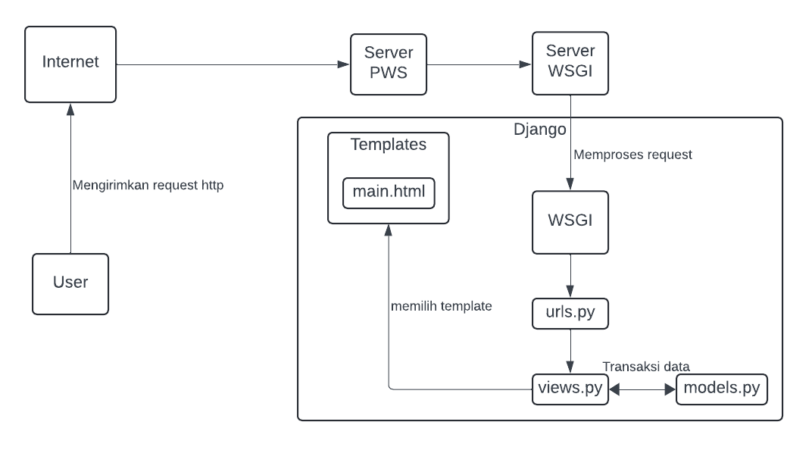

# Pro Shop

Repositori ini berisi aplikasi web berbasis Django untuk mengelola dan menampilkan katalog produk golf. Aplikasi ini dikembangkan sebagai bagian dari tugas mata kuliah PBP.

## Step by step proyek

### A. Membuat repositori baru dan inisialisasi git
1. Buat repositori baru bernama `pro-shop`
2. Pilih sebuah direktori lokal dan inisialisasi git:
    ```bash
    git init
    git remote add origin <URL>
    ```

### B. Membuat virtual environment
1. Aktifkan virtual environment:
    - **Windows**:
        ```bash
        env\Scripts\activate
        ```
    - **Linux/macOS**:
        ```bash
        source env/bin/activate
        ```
### C. Menginstall package
1. Buat file `requirements.txt` dengan isi daftar package yang diperulkan.
2. Jalankan perintah untuk menginstall package yang diperlukan:
     ```bash
    pip install -r requirements.txt
    ```

### D. Membuat proyek Django
1. Buat proyek Django baru dengan nama `pro_shop`
    ```bash
    django-admin startproject kanade_record_store
    ```
2. Buat aplikasi baru bernama `main`
    ```bash
    django-admin startapp main
    ```
3. Tambahkan `localhost` dan `127.0.0.1` ke dalam list `ALLOWED_HOSTS` pada `settings.py`
4. Tambahkan aplikasi `main` ke dalam list  `INSTALLED_APPS` pada `settings.py`
5. Tambahkan kode berikut pada file `views.py` untuk mengintegrasikan komponen MVT:
    ```python
    from django.shortcuts import render

    def show_main(request):
        context = {
            'app_name' : 'Pro Shop',
            'name': 'Fadhli Raihan Ardiansyah',
            'class': 'PBP D',
        }
        return render(request, "main.html", context)
    ```
6. Buat direktori baru bernama `templates` di dalam direktori `main`
7. Di dalam `templates` buat file `main.html`:
    ```html
    <p>{{ app_name }}</p>
    <h5>Nama: </h5>
    <p>{{ name }}</p> 
    <h5>Class: </h5>
    <p>{{ class }}</p> 
    ```
8. Buat file `urls.py` baru di direktori main kemudian isi dengan kode berikut:
    ```python
    from django.urls import path
    from main.views import show_main

    app_name = 'main'

    urlpatterns = [
        path('', show_main, name='show_main'),
    ]

9. Buka file `urls.py` **yang berada di dalam direktori proyek** dan tambahkan kode berikut:
    ```python
    ...
    from django.urls import path, include
    ...
    urlpatterns = [
        ...
        path('', include('main.urls')),
        ...
    ]
    ```
10. Di `models.py` tambahkan atribut berikut:
    ``* name = models.CharField(max_length=255)
    ``* price = models.IntegerField
    ``* description = models.TextField

11. Jalan kode berikut untuk membuat migrasi model dan menjalankannya:
    ```python
    python manage.py makemigrations
    python manage.py migrate
    ```

12. Buat proyek baru di Pacil Web Service dengan nama `proshop`
13. Pada file `settings.py` tambahkan `fadhli-raihan-proshop.pbp.cs.ui.ac.id`
14. Lakukan `git add`, `commit`, dan `push` ke repositori
15. Tambahkan remote pws ke repositroi:
    ```bash
    git remote add pws http://pbp.cs.ui.ac.id/fadhli.raihan/proshop
    git branch -M master
    git push pws master
    ```

16. Sekarang aplikasi dapat diakses dengan url `fadhli-raihan-proshop.pbp.cs.ui.ac.id`

## Bagan request client ke web aplikasi berbasis Django


1. Saat user mengirimkan request http ke server PWS, request tersebut akan diteruskan ke server WSGI
2. Server WSGI mengarahkan request ke aplikasi Django
3. `urls.py` mencocokkan URL dan meneruskan ke view yang sesuai
4. `views.py` memproses request dan mengambil data yang dibutuhkan dari `models.py`
5. `views.py` mengembalikan respons berupa template HTML yang kemudian dikirimkan ke user

## Fungsi Git dalam pengembangan perangkat lunak
Git berfungsi sebagai sistem kontrol yang memungkinkan developer untuk melacak perubahan kode, bekerja secara kolaboratif, mengelola berbagai versi proyek, dan mendukung penggabungan kode dari beberapa developer secara aman dan terstruktur. Git juga membantu dalam melihat riwayat perubahan, memudahkan pengembalian ke versi sebelumnya, dan memungkinkan pengembangan paralel melalui fitur branching.

## Mengapa framework Django dijadikan permulaan pembelajaran pengembangan perangkat lunak
1. Django menggunakan bahasa pemrograman Python yang relatif mudah
2. Django menyediakan arsitektur Model-View-Template (MVT) yang membantu pemula memahami konsep dasar pengembangan web dengan jelas.
3. Django menawarkan banyak fitur bawaan seperti sistem autentikasi, ORM, dan sistem administrasi yang memudahkan developer.

## Mengapa model pada Django disebut sebagai ORM?
Model pada Django disebut ORM (Object-Relational Mapping) karena Django menyediakan sistem yang secara otomatis memetakan objek-objek python (model) ke tabel-tabel di database. Dengan ORM developer dapat berinteraksi dengan data langsung menggunakan bahasa pemrograman Python tanpa menggunakan SQL.


